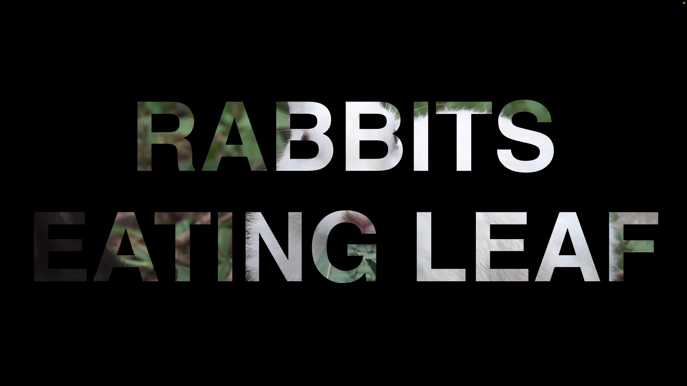

# Video in Text Background Using HTML CSS

Transform your website's visual storytelling with a captivating video-in-text background effect crafted using HTML and CSS. By seamlessly embedding video content within textual elements, you can create a dynamic and immersive user experience that instantly grabs attention. This innovative technique allows you to seamlessly integrate video into the background of text, elevating your website's aesthetics and engaging visitors with an interactive and visually compelling narrative. Enhance your brand's messaging and captivate your audience with this cutting-edge design feature.

Live Preview: https://videointextbackground.vercel.app/

